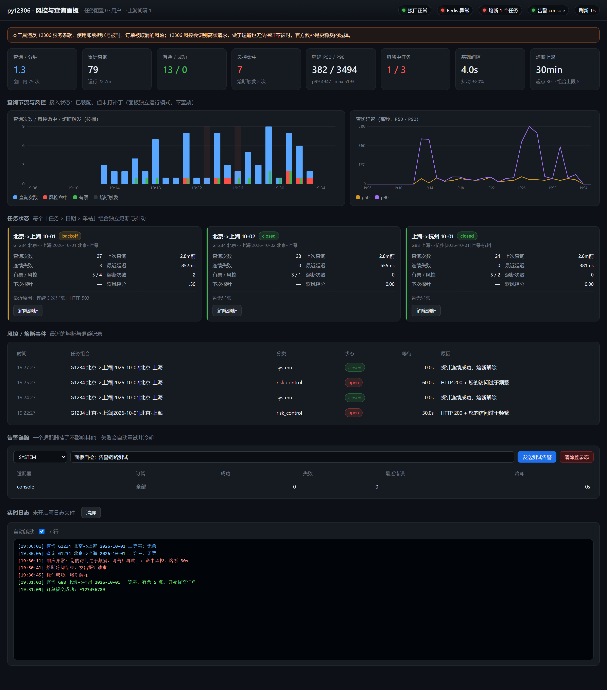

# py12306-pro

> ⚠️ **风险提示（必读）**
> - 本工具**违反 12306 服务条款**，使用即承担**账号被封、订单被取消**的风险。
> - 12306 风控会识别高频请求；**即使做了指数退避和熔断，也无法保证不被封**。
> - 账号密码与实名信息由使用者自行提供；本工具不存储明文（登录态加密落盘、日志全局脱敏）。
> - **官方候补功能是更稳妥、且合规的选择**。本仓库的候补模式走的就是官方渠道，优先于脚本硬抢。
> - 本文档不构成法律建议，合规性由使用者自行确认。

在 [pjialin/py12306](https://github.com/pjialin/py12306)（Apache-2.0）基础上做的生产化改造：
**风控熔断 / 自适应抖动 / 密钥环境变量化 / 日志脱敏 / 登录态加密 / 零构建可视化面板 / 候补模式**。



---

## 1. 30 秒上手

### 1.1 Docker Compose（推荐，含 Redis）

```bash
cp .env.example .env
# 必填三项：USER_ACCOUNTS_JSON、JWT_SECRET_KEY、RUNTIME_ENC_KEY
chmod 600 .env

docker compose up -d
docker compose logs -f py12306
```

起来之后：

| 地址 | 说明 |
|---|---|
| http://127.0.0.1:8010/panel/ | **可视化面板**（指标、时序、逐任务熔断状态、风控告警、实时日志） |
| http://127.0.0.1:8008/ | 上游自带 Web 界面（保留原样） |
| http://127.0.0.1:8010/panel/api/metrics.prom | Prometheus 文本指标 |

自检：

```bash
docker compose run --rm py12306 -t          # 启动自检，退出码 0/1，可直接当健康检查
docker compose run --rm py12306 -t --json   # 机器可读
```

### 1.2 本地

```bash
python -m venv .venv && . .venv/bin/activate     # Windows: .venv\Scripts\activate
pip install -r requirements-lock.txt
cp .env.example .env && $EDITOR .env

python main.py -t                # 自检
python main.py serve --port 8010 # 只启面板（不查票，用于调界面）
python main.py                   # 上游抢票流程（已接入熔断与抖动）
python main.py --purge-login-state
```

没有真实账号想先看面板长什么样：

```bash
python tools/seed_demo.py --minutes 20    # 灌入仿真指标（不联网、不碰账号）
python main.py serve --port 8010
```

---

## 2. 可视化面板

零构建：单个 HTML + 原生 JS + 手写 SVG 图表，**不依赖任何 CDN**（内网/离线可用），
不引入 Node 构建链。图标由 `tools/make_favicon.py` 用标准库手写 PNG 生成。

| 区块 | 内容 |
|---|---|
| 顶部状态灯 | 接口 / Redis（带延迟）/ 熔断任务数 / 告警适配器健康度 |
| 指标卡 | 查询每分钟、累计查询、有票+成功、风控命中、延迟 p50/p90/p99/max、熔断中任务、基础间隔与抖动、熔断上限 |
| 查询节流图 | 按桶的查询次数 / 风控命中 / 有票 / 熔断触发（柱子叠加） |
| 延迟图 | p50 与 p90 折线 |
| 任务卡 | **每个「任务 × 日期 × 车站」组合**的熔断状态、连续失败次数、下次探针倒计时、最近延迟、软风控分、最近原因、一键解除熔断 |
| 风控事件表 | 最近的熔断 / 退避 / 恢复记录（分类、状态、等待秒数、原因） |
| 告警链路 | 适配器列表与失败冷却状态、最近发送结果、可直接发测试告警、一键清除登录态 |
| 实时日志 | SSE 增量推送（自动降级为轮询），风控行红色高亮 |

### 面板安全（spec 第 7 条）

- **默认只允许本机**（127.0.0.1 / ::1）访问 `/panel` 与 `/panel/api/*`。
- 容器/远程场景需显式 `PANEL_ALLOW_REMOTE=1`；建议同时设置 `PANEL_TOKEN`，
  通过 `X-Panel-Token` 头或 `?token=` 传入。
- 面板**不返回任何密钥**：配置走 `Config.scrub()`，告警消息再过一遍脱敏。
- 上游 Web 界面硬编码的 JWT 密钥 `'secret'` 已移除，改为必须来自 `JWT_SECRET_KEY`，
  缺失时拒绝启动（`DEV_MODE=1` 才用临时随机密钥）。

---

## 3. 风控熔断与查询节流（核心）

### 3.1 状态机

```
CLOSED ──连续 N 次 5xx/超时──▶ BACKOFF ──等待结束──▶ CLOSED
   │                              （3s→6s→12s…封顶 120s，带抖动）
   └──命中风控特征──────────────▶ OPEN ──冷却结束──▶ HALF_OPEN ──探针成功──▶ CLOSED
                                   │   （30s→60s…封顶 30min）        │
                                   └──────────探针失败────────────────┘
```

粒度是 **「任务 × 日期 × 车站」**：撞墙的往往只是一个组合，全局熔断会误伤其他正常组合。

### 3.2 真的接进了查询循环

`railkit/integration.py` 对上游 `Job@@ 打补丁（不改上游业务代码，可读可测可撤）：

| 补丁点 | 作用 |
|---|---|
| `Job.safe_stay` | 换成「熔断决策 + 逐组合抖动」；**熔断中直接不发请求**，只等待 |
| `Job.get_results` | 无论成功还是被 `Request.request()` 吞成空响应，都记一次指标 |
| `Job.handle_response` | 拿到余票结果后记「有票」并让熔断器学习 |

### 3.3 风控特征识别

`classify_response(status, headers, body)` 是纯函数：

| 输入 | 判定 |
|---|---|
| 5xx | `server` → 计入连续异常，退避 |
| 超时 / 连接失败 / TLS 错误 | `transport` → 同上 |
| 401 / 302 | `auth` → **不计入熔断**（该重新登录，撞墙没用），但立刻告警 |
| 403 / 429 | `rate_limit` → 立即熔断 |
| **HTTP 200 + 正文含「您的访问过于频繁」等** | `risk_control` → 立即熔断（12306 最常见的形态） |
| 响应头 `X-Risk-Control` / `X-Captcha-Challenge` | `risk_control` |
| `Retry-After` | 熔断等待取 `max(指数退避, Retry-After)`，受 `max_wait_seconds` 约束 |

### 3.4 逐组合独立抖动

```python
stream = new_stream("G1234 北京->上海|2026-10-01|北京-上海")   # 由 key 派生确定性随机流
delay = next_query_delay(timing, pre_sale=False, stream=stream, override=4.0)
```

同一个组合可复现，不同组合互不相关。**抖动流按 key 长期持有**——每次重建随机流会让首个随机数恒定，
看起来像没有抖动（这个坑有单测锁住）。

### 3.5 调参环境变量

`QUERY_INTERVAL`（基础间隔，默认 4s）、`RISK_FAILURE_THRESHOLD`、
`RISK_BREAKER_BASE` / `RISK_BREAKER_CAP` / `RISK_BREAKER_MULTIPLIER`、
`RISK_SOFT_THRESHOLD`、`RISK_JITTER_RATIO`、`MAX_STATION_PAIRS`（默认 5，防查询量爆炸）。

---

## 4. 候补购票模式

走 12306 官方候补渠道：合规性远好于脚本硬抢，成功率通常也更高。

```bash
# .env 里配置一条候补申请
WAITLIST_JSON={"left_date":"2026-10-01","left_station":"北京","arrive_station":"上海",
  "train_numbers":["G1","G3"],"seat_types":["O"],"accept_no_seat":true,
  "passengers":[{"passenger_name":"张三","passenger_id_no":"110101...","passenger_id_type_code":"1","passenger_type":"1"}]}
```

- 状态机：`pending_submit → queued → fulfilled / failed / expired / canceled`，
  **只在状态真的变化时告警**，不会每分钟一条噪音。
- 轮询退避：90s 起步、指数放大、30min 封顶、带抖动；到上限会告警而不是无限跑。
- 兑现成功 / 未兑现 / 取消都会推对应事件（`TICKET_SUCCESS` / `TICKET_ALL_FAILED` / `SYSTEM`）。

> **端点需要你自己核实一次**
> 12306 的候补接口没有公开文档，路径会变。本项目把端点集中在
> `railkit/waitlist.py: DEFAULT_ENDPOINTS`，且**未经实测**。首次使用前请对着抓包核对，
> 用 `WAITLIST_SUBMIT_URL` / `WAITLIST_QUERY_URL` / `WAITLIST_CANCEL_URL` 覆盖。
> 状态解析刻意保守：**识别不出来时报 ERROR 而不是猜成成功**，避免「假兑现」告警。
> 离线验证整条链路用 `SimulatedBackend`（测试里跑的就是它）。

---

## 5. 环境现代化与依赖

| 项 | 改造前 | 改造后 |
|---|---|---|
| 基础镜像 | `python:3.6.6-slim`（已 EOL） | `python:3.11-slim` |
| 系统依赖 | 缺字体等 | `libxml2-dev` `libxslt1-dev` `gcc` `fonts-noto-cjk`（缺 CJK 字体验证码识别率暴跌）`ca-certificates` `curl` `tzdata` |
| 运行用户 | root | 非 root（uid/gid 10001） |
| pip 源 | 硬编码清华源 | `PIP_INDEX_URL` 构建参数，默认官方源 |
| 依赖表达 | 一份锁死清单 | 三层：`requirements.in`（区间）/ `requirements-lock.txt`（精确锁）/ `constraints-py311.txt`（3.11 上限+理由） |

锁文件生成方式（已执行，不要手改版本号）：

```bash
pip install --dry-run --ignore-installed --python-version 3.11 --only-binary=:all: \
  --report report.json -r requirements.in -c constraints-py311.txt
```

**已验证**：锁文件里每个版本都在 PyPI 上有 `cp311` 的 manylinux/musllinux wheel 或纯 Python wheel，
`python:3.11-slim` 上不会触发源码编译（唯一例外 `pyppeteer-box` 只有 sdist，自身无 C 扩展）。

Compose 编排（spec 第 2 节）：Redis `--appendonly yes` + healthcheck + 四个命名卷，
`py12306` 用 `depends_on: condition: service_healthy` 等 Redis 真就绪，
**登录态卷（`runtime-data`）与业务数据卷分开挂**。

---

## 6. 安全

- **密钥全部环境变量化**：`settings.py` 只留非敏感常量；旧 `env.py` 可用
  `LOAD_LEGACY_ENV=1` 迁移，且会告警提醒删除。
- **启动即校验、失败关闭**：字段名写错、区间格式错、JWT 密钥缺失/过短、
  `WEB_BIND=0.0.0.0` 却没配 IP 白名单、启用 dingtalk 却没给 webhook —— 一次性列出所有问题并拒绝启动。
- **登录态加密落盘**：AES-GCM（scrypt 派生密钥，遇 OpenSSL 内存上限自动降级 PBKDF2-HMAC-SHA256），
  原子写 + 0600（Windows 用 icacls 去继承），没配 `RUNTIME_ENC_KEY` 就拒绝明文落盘；
  `python main.py --purge-login-state` 一键清除。
- **日志全局脱敏**：挂在 root 与所有 handler 上（只挂 logger 会漏掉 propagate 的日志）。
  覆盖身份证、手机号（含打码形式）、邮箱、`password`/`token`/`api_key` 赋值、
  Cookie（保留 cookie 名、值打掉）、长不透明串。

---

## 7. 测试

```bash
pytest -q --basetemp=.pytest-tmp      # 全部离线：不联网、不连 Redis、不 sleep
```

当前 **325 个用例**，覆盖：

| 文件 | 覆盖 |
|---|---|
| `tests/test_timing.py` | 抖动区间、逐组合独立、开售前激进窗、指数退避阶梯、`Retry-After`、跨零点时段 |
| `tests/test_risk.py` | 响应/异常分类（含 200+风控串）、退避与恢复、熔断立即触发、探针单飞/复归/翻倍、软信号衰减、组合上限、快照字段 |
| `tests/test_redaction.py` | 各类密钥脱敏、误伤防护、自定义正则、logging Filter |
| `tests/test_config.py` | 账号解析与报错、字段名写错即报错、时段解析、密钥长度、公网绑定需白名单、`.env` 优先级、旧 `env.py` 迁移 |
| `tests/test_security.py` | 登录态加解密往返、篡改检测、明文拒绝、一键清除、通知重试与冷却、适配器隔离 |
| `tests/test_metrics.py` | 采集、分位、时间序列分桶、重启回载、Prometheus 导出与标签转义 |
| `tests/test_integration.py` | 假 Job/假响应：结果分类、熔断真的阻断查询、抖动真实存在、逐组合独立、组合上限、开售窗 |
| `tests/test_panel.py` | 访问控制（本机/远程/Token/XFF）、各 API、动作接口、密钥不外泄、零外部 CDN |
| `tests/test_waitlist.py` | 状态解析保守性、表单构造、离线端到端、退避、去重告警 |

时序类测试全部用**假时钟**，不 sleep，跑得快且不 flaky。UI 渲染另有
`tools/cdp_screenshot.mjs`（用本机 Chrome 的 CDP 截图并回报控制台错误、卡片数、图表元素数）。

---

## 8. 目录结构

```
main.py                     # 统一入口（railkit.cli 分发）
upstream_entry.py           # 上游抢票流程（原 main.py 内容）
settings.py                 # 非敏感常量
railkit/
  config.py                 # 环境变量配置 + 启动即校验
  redaction.py              # 日志脱敏
  notifier.py               # 统一通知接口 + 适配器（钉钉/ServerChan/Bark/webhook/console）
  timing.py                 # 抖动 / 退避纯函数
  risk.py                   # 风控分类 + 熔断器
  metrics.py                # 指标库（内存窗口 + SQLite，可回载）
  integration.py            # 把熔断/抖动/指标接进上游查询循环
  runtime_state.py          # 登录态加密落盘
  waitlist.py               # 候补模式（官方渠道）
  selfcheck.py              # 自检
  cli.py                    # 入口引导与环境变量桥接
py12306/
  panel/                    # 可视化面板（Flask 蓝图 + 零构建 UI）
  ...                       # 上游业务代码（仅 web.py 有最小改动：JWT 密钥 + 注册面板蓝图）
tests/                      # 325 个离线用例
tools/                      # 仿真指标、CDP 截图、图标生成
docker-compose.yml          # Redis(appendonly) + py12306，健康检查与卷分离
```

---

## 9. 与上游的关系

- 保留上游全部业务逻辑（登陆、下单、乘客、CDN、集群），上游 Web 界面原样可用。
- 对上游的**唯一侵入式改动**：`py12306/web/web.py`（移除硬编码 JWT 密钥 + 注册面板蓝图），
  以及 `main.py` 更名为 `upstream_entry.py`（内容不变）。
- 其余全部是**新增层**（`railkit/`、`py12306/panel/`），可单独测试、可单独摘除。
- 上游 `docker-compose.yml.example` / `env*.py.example` 保留，便于对照与回退。

---

## 10. 已知限制

- 候补接口路径**未经实测**（见第 4 节），首次使用需按抓包核对。
- 本机没有 Docker，`docker compose up` 与镜像构建**未在真实 Docker 里跑过**；
  Dockerfile 的依赖已在干净 venv 中验证可装，compose 文件已用 YAML 解析器校验结构。
- 面板是"够用"级别：原生 JS + 手写 SVG，没有引入图表库（换来了零构建、离线可用）。
- `max_station_pairs` 默认 5：多车站组合会成倍放大查询量，超过上限直接拒绝而不是静默截断。
