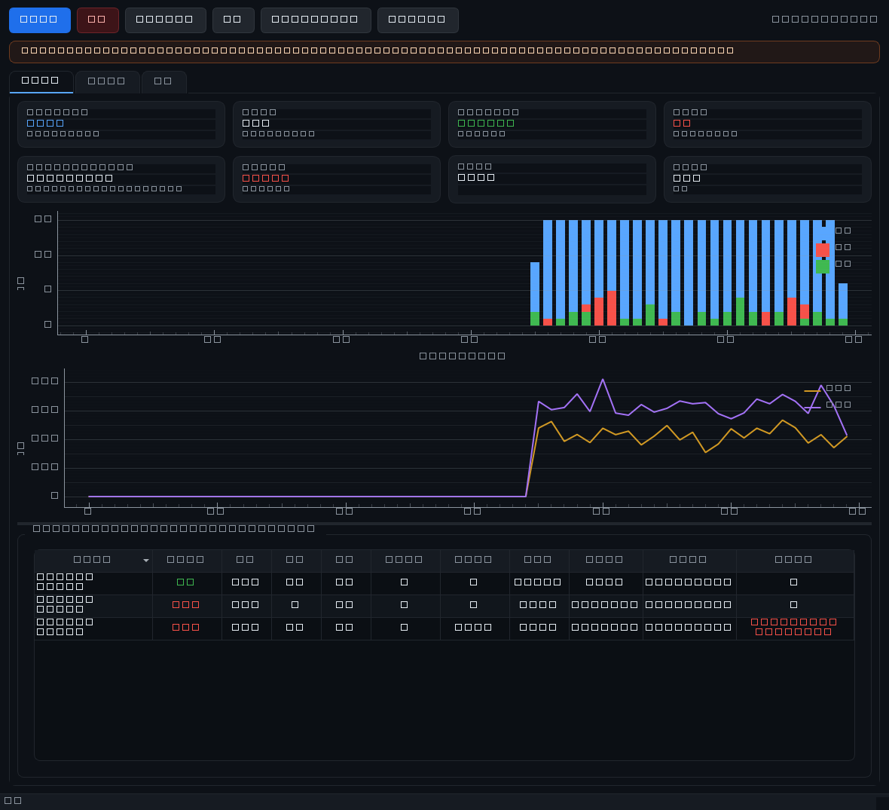

# py12306 抢票助手（桌面版）

> ⚠️ **风险提示（必读）**
> - 本工具**违反 12306 服务条款**，使用即承担**账号被封、订单被取消**的风险。
> - 12306 风控会识别高频请求；**即使做了指数退避和熔断，也无法保证不被封**。
> - **官方候补功能是更稳妥、且合规的选择**，本程序的候补模式走的就是官方渠道，优先于脚本硬抢。
> - 账号密码由使用者自行提供；本程序不存储明文（登录态加密落盘、日志全局脱敏）。
> - 本文档不构成法律建议，合规性由使用者自行确认。

一个能直接双击运行的 Windows 桌面程序：界面看板 + 后台抢票引擎 + 可选 Web 面板。
不需要 Docker、不需要 Redis、不需要额外服务。



---

## 1. 快速开始（Windows，两步）

```text
1. 双击「安装环境.bat」     —— 自动创建 .venv 并安装依赖（只需一次）
2. 双击「启动py12306.bat」  —— 打开程序窗口
```

第一次启动后：把 `.env`（参考 `.env.example`）放到**数据目录**（默认 `文档\py12306`，
程序「设置」页会显示具体路径），填好账号与任务，再点「开始抢票」。

没有界面/不想用界面时，同一个 `app.py` 也支持命令行：

```bash
python app.py                 # 启动桌面窗口（默认）
python app.py -t              # 自检，退出码 0/1，结果写到 数据目录/logs/selfcheck.txt
python app.py serve           # 只启动 Web 面板
python app.py waitlist        # 候补模式
python app.py -h              # 全部参数
```

---

## 2. 代码架构

参照 `host_app` 的分层：**薄入口 + core（无界面业务层）+ ui（Qt 界面）+ packaging（打包）**。
core 里没有任何 Qt/Flask 依赖，所以它能被单独测试、也能被命令行直接复用。

```text
app.py                     程序入口（98 行级薄壳）
                            · 参数分发（GUI / -t / serve / waitlist）
                            · 崩溃处理器：写 数据目录/logs/崩溃日志_*.txt + 弹窗
                            · --selfcheck：起来后自动退出，供无人值守验证
core/                      业务层（不 import Qt / Flask）
  paths.py                 数据目录管理（文档\py12306，可用 PY12306_DATA_DIR 覆盖）
  version.py               APP_NAME / __version__ 单一来源
  logging_setup.py         日志初始化（轮转 + 脱敏 + 崩溃日志）
  settings.py              界面可改的设置（settings.json 落盘，含密钥的一律不写）
  config.py                .env 读取与启动校验（字段错就报错，静默失效是大忌）
  uplink.py                上游桥接：账号/任务推给 py12306，状态取回给界面
  engine.py                抢票引擎（后台线程，可安全停止）
  monitor.py               状态门面：把指标整理成界面要用的 Snapshot
  metrics.py               指标库（内存窗口 + SQLite，重启回载）
  risk.py                  风控熔断器（CLOSED→BACKOFF→OPEN→HALF_OPEN）
  timing.py                抖动 / 退化纯函数
  integration.py           把熔断与抖动接进上游查询循环
  notifier.py              统一告警接口 + 适配器（钉钉/ServerChan/Bark/webhook/console）
  redaction.py             日志脱敏
  runtime_state.py         登录态 AES-GCM 加密落盘 + 一键清除
  waitlist.py              候补模式（官方渠道）
  selfcheck.py             自检
  cli.py                   命令行分发
ui/                        Qt 界面（只读 core，不直接碰上游对象）
  theme.py                 深色主题 + 字体探测
  dashboard_widgets.py     状态卡 / 曲线图 / 任务表 / 事件表
  main_window.py           主窗口：运行看板 / 风控事件 / 设置
  panel_thread.py          在后台线程里起 Web 面板
webpanel/                  可选 Web 面板（Flask 蓝图，零构建前端）
py12306/                   上游业务代码（登录、下单、乘客、CDN），只做必要的兼容修补
packaging/                 PyInstaller 配置 + 图标生成 + 安装包脚本
tests/                     397 个用例（pytest 或 tests/run_all.py 都能跑）
tools/                     截图、仿真数据、锁文件生成、依赖对账等开发脚本
```

### 线程模型

```text
UI 线程 ──QTimer 1 秒──▶ core.monitor ──读──▶ core.metrics（内存窗口 + SQLite）
   │                                              ▲
   └──开始/停止──▶ core.engine（后台线程）──写──────┘
                        │
                        └─▶ 上游 py12306 查询循环（已接入熔断与自适应抖动）
```

界面永远不会被网络或抢票速度拖住：所有耗时动作都在引擎线程里，界面只读快照。

### 与上游的关系

- 上游业务逻辑完整保留（登录、下单、乘客、CDN、集群代码都在）。
- 对上游的修补只有四处，且都有回归测试：
  1. `@jwt_required` → `@jwt_required()`（Flask-JWT-Extended 4.x 要求调用）；
  2. 受保护路由补显式 `endpoint=`（4.x 不再保留 `__name__`，否则 Web 界面起不来）；
  3. `Web.__init__` 注册蓝图改为幂等（重建实例不再抛 endpoint 冲突）；
  4. `get_file_modify_time` 对不存在的配置文件返回 0（纯 `.env` 部署时不再崩）。
- 其余全是新增层。上游原本的 `main.py` 保留为 `upstream_entry.py`。

---

## 3. 界面说明

| 标签页 | 内容 |
|---|---|
| **运行看板** | 8 张指标卡（每分钟查询、累计查询、有票/成功、风控命中、延迟 p50/p90、熔断中任务、基础间隔、运行时长）；查询量/风控/有票分桶柱状图；延迟 p50/p90 折线；任务组合表（熔断状态、连续失败、下次探针、有票率、最近原因） |
| **风控事件** | 退避与熔断事件表（分类/状态/等待秒数/原因）+ 实时日志（读上游日志文件，自动滚动） |
| **设置** | 查询节奏、风控阈值、告警渠道、Web 面板、维护时段开关、登录态清除、环境信息 |

工具栏：开始抢票 / 停止 / 解除全部熔断 / 自检 / 启动 Web 面板 / 打开日志目录。

**熔断粒度是「任务 × 日期 × 车站」**：撞墙的往往只是一个组合，全局熔断会误伤其它正常组合。

### Web 面板（可选）

点工具栏「启动 Web 面板」，浏览器会打开 `http://127.0.0.1:8010/panel/`。
默认只允许本机；要局域网访问需 `PANEL_ALLOW_REMOTE=1`，建议同时设 `PANEL_TOKEN`。
面板与桌面看板读的是**同一份指标库**，两处数据一致。

---

## 4. 目录与数据

程序目录只放代码；**所有用户数据都在数据目录**（默认 `文档\py12306`）：

```text
文档\py12306\
  .env              账号、任务、密钥（自己创建，程序不写）
  settings.json     界面设置（不含密钥）
  logs\             py12306.log、12306.log、崩溃日志、selfcheck.txt
  metrics\          metrics.sqlite3（指标库，面板与看板共用）
  runtime\user\     登录态（AES-GCM 加密，0600/ACL 收紧）
```

要换位置就设 `PY12306_DATA_DIR`（例如 `D:\py12306-data`）。

---

## 5. 打包成 exe

```bash
.venv\Scripts\pyinstaller packaging\py12306.spec --noconfirm
# 产物：dist\py12306\py12306.exe
```

图标由 `packaging/make_icon.py` 用标准库生成（不引入 Pillow）。
打包后仍支持 `--selfcheck`：无人值守验证 exe 能否正常起来，结果写到
`数据目录/logs/selfcheck.txt`。

---

## 6. 测试

```bash
pytest -q --basetemp=.pytest-tmp     # 推荐（397 个用例）
python tests/run_all.py              # 零依赖方式，不装 pytest 也能跑
```

全部离线：不联网、不连 Redis、不 sleep。界面测试用 `QT_QPA_PLATFORM=offscreen`，
没有 PySide6 的环境会自动跳过。

覆盖范围：风控分类与熔断状态机、抖动与退避、逐组合独立抖动、日志脱敏（含误伤防护）、
配置校验（字段写错即报错）、登录态加解密与清除、指标库与重启回载、候补状态机、
上游模块逐个 import、上游 Web 路由与 JWT 端到端、桌面窗口搭建与刷新、设置存取与收敛。

---

## 7. 已知限制

- **候补端点未经实测**：12306 候补接口无公开文档，路径集中在
  `core/waitlist.py: DEFAULT_ENDPOINTS`，可用 `WAITLIST_*_URL` 覆盖。
  状态解析刻意保守：识别不出来报 ERROR，绝不猜成成功。
- **没有实盘验证过抢票**：本机无法登录真实 12306，所以下单链路只做了代码级兼容修补与单元测试，
  第一次真实使用建议先用 `python app.py -t` 自检、再小规模试跑。
- 打包产物**在本机未验证**（本机没有 PyInstaller 运行环境所需的完整桌面环境，
  但 spec 里的 datas/hiddenimports 已按本仓库实际路径写好）。
- 上游若在 12306 接口变更后失效，本程序的风控/指标层仍可用，但查询会拿不到结果。

---

## 8. 致谢与许可

- 基于 [pjialin/py12306](https://github.com/pjialin/py12306)（Apache-2.0），保留其全部业务代码与 LICENSE。
- 本仓库的改造部分（core/、ui/、webpanel/、packaging/、tools/）同样以 Apache-2.0 发布。
